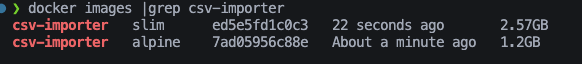
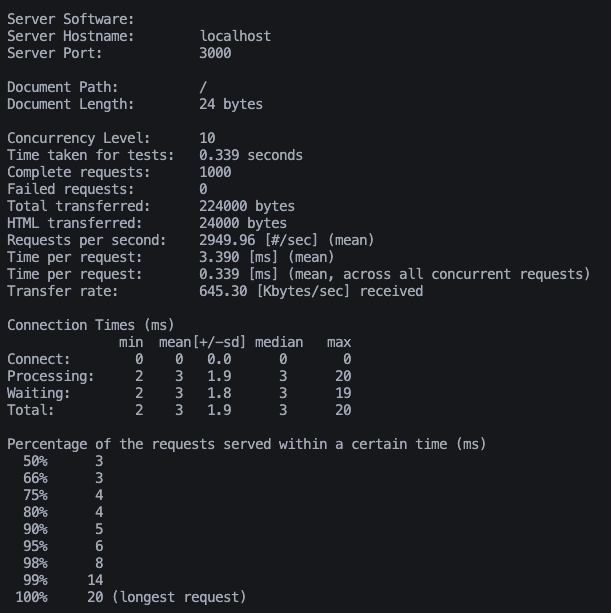
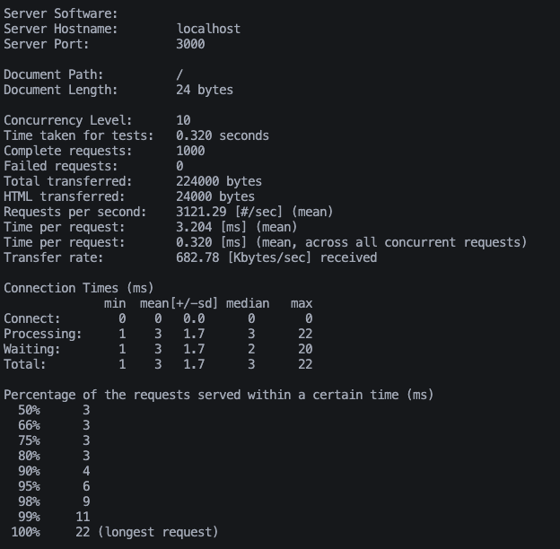
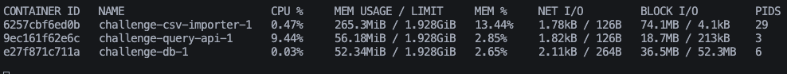
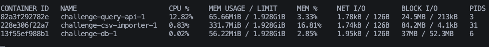
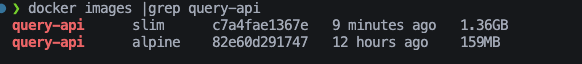
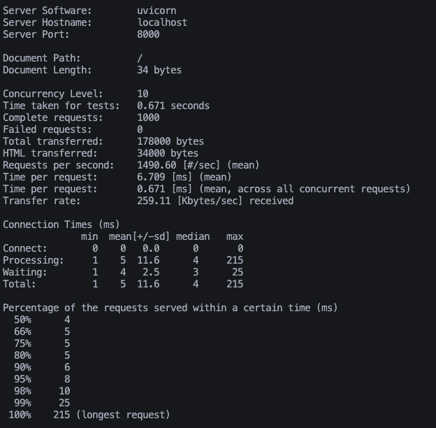

# Challenge

## Services

- ### csv-importer

  NestJS framework with PostgreSQL

- ### query-api

  FastAPI framework with PostgreSQL for querying

- ### db

  The db we are using is PostgreSQL version 15

## Requirements:

- Docker desktop / Docker, Docker Compose
- Make (only for Linux, WSL or MacOS)

## How to start the project (Windows / MacOS / Linux / WSL)

1. Clone the repository
2. Navigate to the root folder of the project (challenge)
3. Start all the services `docker compose up --build`:
   - csv-importer: http://localhost:3000
   - query-api: http://localhost:8000
   - PostgreSQL: localhost:5432 (user: postgres, password: postgres, db: importer)
4. Stop all the services `docker compose down`

## How to start project (MacOS / Linux / WSL)

In this OS you can use Makefile which is simple way to put everything together

1. Clone the repository
2. Use commands inside _Makefile_, some examples:
   - `make start`
   - `make stop`

## API Documentation & Usage

### query-api (FastAPI)

- **Swagger UI:** [http://localhost:8000/docs](http://localhost:8000/docs)
- **ReDoc:** [http://localhost:8000/redoc](http://localhost:8000/redoc)

All endpoints are documented with descriptions and query parameters in Swagger UI. You can try out requests directly from the browser.

#### Main Endpoints

- `/countries` — List countries, filter by id, code, or name. Supports pagination and sorting.
- `/parent-sectors` — List parent sectors, filter by id or name. Supports pagination and sorting.
- `/sectors` — List sectors, filter by id, name, or parent_sector_id. Supports pagination and sorting.
- `/emissions` — List emissions with flexible filtering:
  - Filter by: `country_id`, `sector_id`, `year`, `emissions`, `country_code`, `country_name`, `sector_name`, `parent_sector_name`
  - All filters are combined with AND logic (e.g., `country_code=ABW&year=2000` returns only ABW in 2000)
  - Supports pagination with `limit` and `offset`
  - Supports sorting with `sort_by` and `order` (asc/desc)
- `/metadata` — Returns total record counts for each table and the latest year in emissions.

##### Example Query

```
GET /emissions?country_code=ABW&year=2000&limit=100&sort_by=year&order=desc
```

Returns all emissions for country code ABW in year 2000 (max 100 results, sorted by year descending).

##### Rate Limiting

- All endpoints are rate limited to 15 requests per minute per IP. Exceeding this limit returns a 429 error.

### csv-importer (NestJS)

- Import CSV data into PostgreSQL with deduplication and batch insertion.
- Returns per-table insert counts, timings, and post-import aggregation (record count, min/max for emissions).
- Winston logger integration for execution time logging.
- See service/controller code for API details (Swagger UI not enabled by default).

## Performance & Profiling

- FastAPI service supports gzip and Brotli compression for large responses (query-api auto-detects client support).
- Database queries are optimized with indexes and AND logic for all filters.
- For very large queries, use pagination. I DO NOT RECOMEND USE GET ALL EVEN IF I IMPLEMENT IT.

## 🚀 Performance Profiling (First Stage)

Below are the results of profiling the image size and basic runtime stats for both services using Alpine and Slim images. Each image name describes its content.

---

### 🟦 csv-importer

**Image Size Comparison:**

<p align="left">
  
</p>

**ApacheBench (ab) Results:**

<table>
  <tr>
    <td align="center"><b>Alpine</b></td>
    <td align="center"><b>Slim</b></td>
  </tr>
  <tr>
    <td></td>
    <td></td>
  </tr>
</table>

**Docker Stats:**

<table>
  <tr>
    <td align="center"><b>Alpine</b></td>
    <td align="center"><b>Slim</b></td>
  </tr>
  <tr>
    <td></td>
    <td></td>
  </tr>
</table>

---

### 🟩 query-api

**Image Size Comparison:**

<p align="left">
  
</p>

**ApacheBench (ab) Results:**

<table>
  <tr>
    <td align="center"><b>Alpine</b></td>
    <td align="center"><b>Slim</b></td>
  </tr>
  <tr>
    <td></td>
    <td></td>
  </tr>
</table>

---

<sub>These results provide a visual comparison of image sizes and basic performance between Alpine and Slim base images for both services.</sub>

## Development & Testing

- Projects are running in dev (watch) mode

## API Reference & Examples

See [http://localhost:8000/docs](http://localhost:8000/docs) for full OpenAPI/Swagger documentation and try out endpoints interactively.

## test-fodler

This directory contains utility scripts for testing and development.

- **rate_limit_test.js**: A Node.js script to test the rate limiting of the query-api service. It sends repeated requests to the /countries endpoint and will print a message when the rate limit (15 requests per minute per IP) is exceeded.

### How to use rate_limit_test.js

1. Install dependencies (if not already):
   ```sh
   npm install axios
   ```
2. Run the script:
   ```sh
   node test-fodler/rate_limit_test.js
   ```

You should see output indicating when the rate limit is hit (HTTP 429 error).

---

<sub>For more details, see the code in `csv-importer/src/importer/service.ts` and `query-api/app/routes.py`.</sub>
